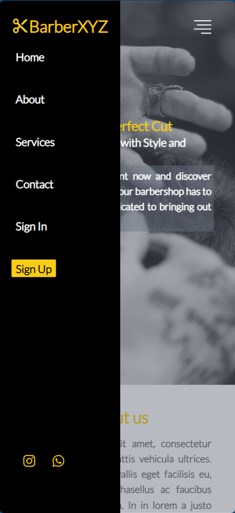
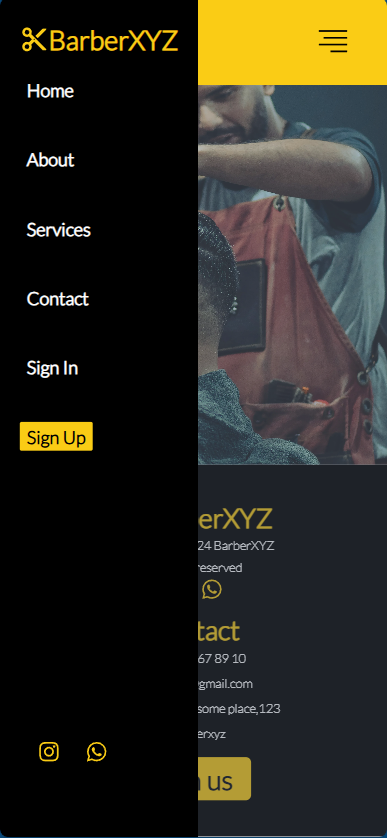

# Barber Shop
**Barber Shop** é uma aplicação desenvolvida com **React** e **Next.js**, projetada para facilitar o gerenciamento de barbearias. Oferece funcionalidades de agendamento de cortes de cabelo e um sistema de pagamento, com um design responsivo e otimizado para uma experiência de usuário impecável.


## 📦 Funcionalidades

- **Agendamento de Cortes de Cabelo**: Permite aos usuários visualizar e selecionar horários disponíveis para agendamento.
- **Sistema de Pagamento**: Integração com métodos de pagamento para facilitar transações.
- **Design Responsivo**: Interface moderna que se adapta a diferentes dispositivos.
- **Otimização de Performance**: Renderização do lado do servidor para tempos de carregamento rápidos.

## ⚙️ Tecnologias Utilizadas

- **React**: Para construção da interface do usuário e componentes interativos.
- **Next.js**: Para renderização do lado do servidor e otimização de desempenho.
- **JavaScript** e **TypeScript**: Para desenvolvimento robusto e funcionalidades seguras.
- **Tailwind CSS** e **CSS**: Para garantir um design moderno e simples.
- **Jest** e **Testing Library**: Para testes automatizados e garantia de qualidade.

## 🚀 Instalação

1. Clone o repositório:

   ```bash
   git clone https://github.com/Matheus-Rodrigues-Araujo/barber-shop.git

   ```

2. No diretório root:

   ```bash
   npm install

   ```

3. Inicie o servidor de desenvolvimento:
   ```bash
   npm run dev
   ```

## 🛠️ Uso

- Visualizar e Agendar Cortes: Navegue até a seção de agendamentos para escolher e reservar horários.

- Gerenciar Pagamentos: Utilize o sistema integrado para realizar pagamentos com segurança.

## 🔧 Testes

```bash
    npm test
```

## 💻 Imagens


